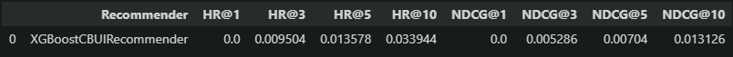

# Project 1: Recommender

### Project description

This project contains user features, item features, recommender code, recommender tuning and validating. The goal is to achieve the best HR@10 in the final evaluation which is done with seed=6789.

<br>

### Project structure

Project contains 5 main files:
- data (contains hotel data on which recommender is running)
- data_processing (contains 3 python files, where you can find methods meant to help manage the original data)
- evaluation_and_testing (contains 2 python files with testing and recommender evaluation)
- features (contains 2 python files, where are user and item features)
- recommenders (contains 8 python files, all are different kinds of recommenders)

There are 2 ".ipynb" files which contains code execution and they are main part of the project

<br>

### Results

The achieved result on XGBoostCBUIRecommender is HR@10 = 0.0339



<br>

### Requirements to run the project

1. Create (and activate) a new environment with Python 3.8.10

2. Install all the libraries with command below
 
    ```
     pip install -r requirements.txt
    ```

3. Start Jupyter Notebook and open files:

	- project_1_data_preparation.ipynb
    - project_1_recommender_and_evaluation.ipynb

<br>

This project was based on https://github.com/PiotrZiolo/recommender-systems-class.git repository, created by Piotr Zioło.