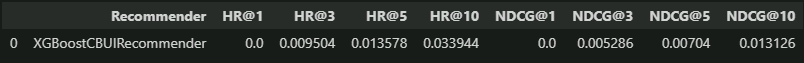

# Report - Project 1: Recommender

### Project description

<h2>Comparing two different data sets:</h2>

 - RandomForestCBUIRecommender:
    - n_neg_per_pos: 9
    - n_estimators: 276
    - max_depth: 7
    - min_samples_split: 19
     
 - XGBoostCBUIRecommender:
    - n_neg_per_pos: 9
    - n_estimators: 276
    - max_depth: 7
    - min_samples_split: 19
    - learning_rate: np.log(2)

<h2>Version1:</h2>

(as it is now)

 - RandomForestCBUIRecommender:

 - XGBoostCBUIRecommender:

<h2>Version2:</h2>
in 'i_room_space_for_people_feature':
 

in 'i_room_price_expensiveness_feature':
 

add user feature 'u_average_values_feature':
 

 - RandomForestCBUIRecommender:

 - XGBoostCBUIRecommender:

<h3>It was also checked for both versions with LinearRegressionCBUIRecommender, but the results where worse.
 
There were more tests while tuning but there is no need for showing them all and comparing.</h3>